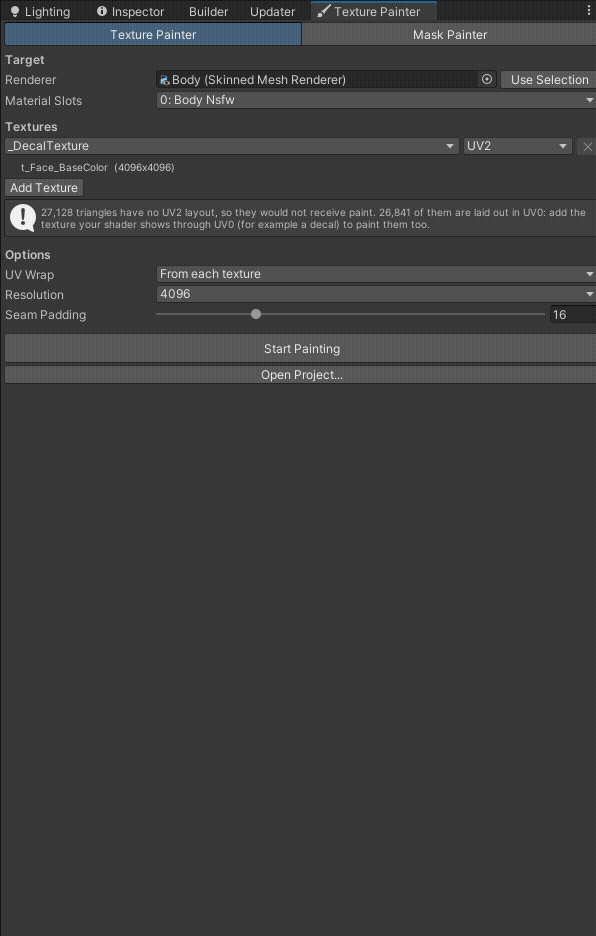
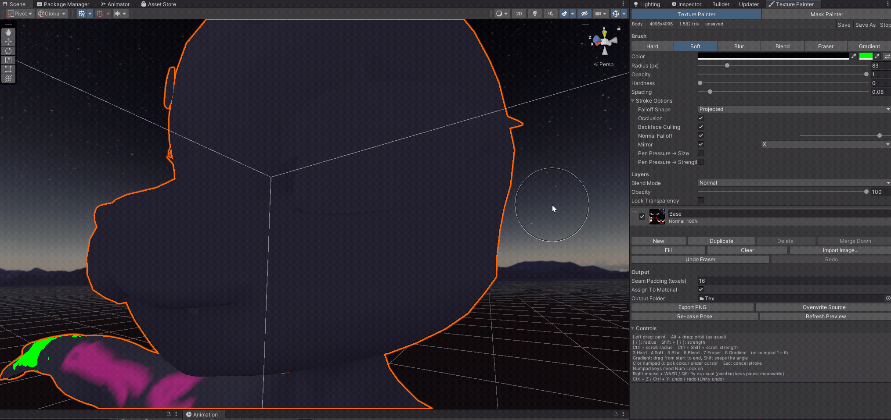
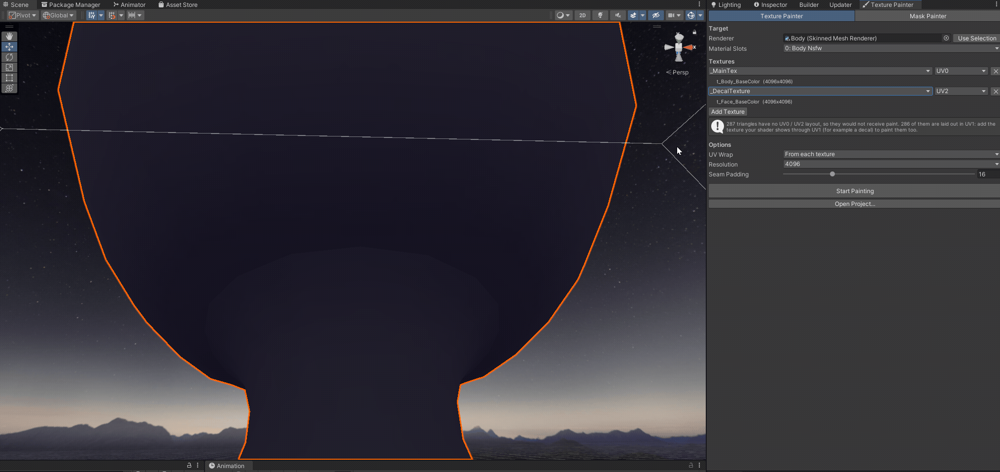
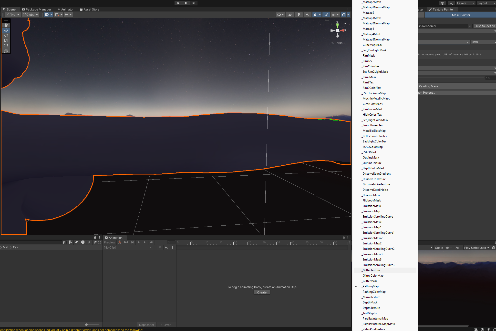
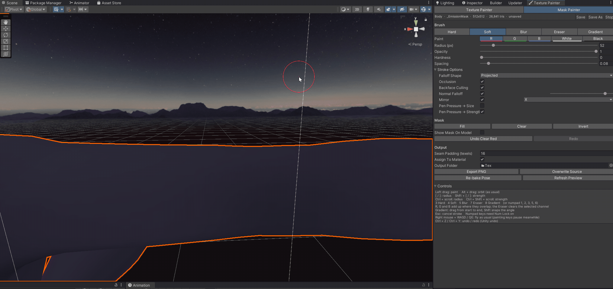
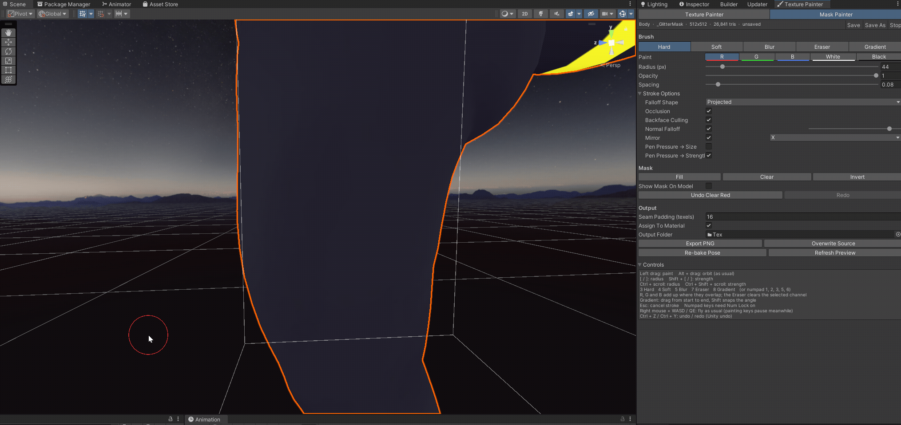
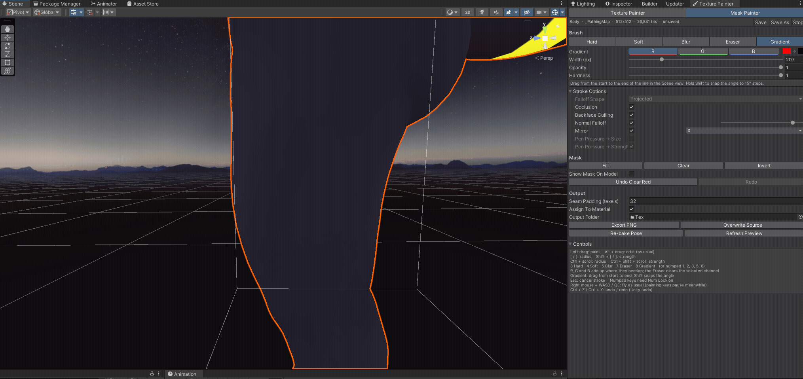
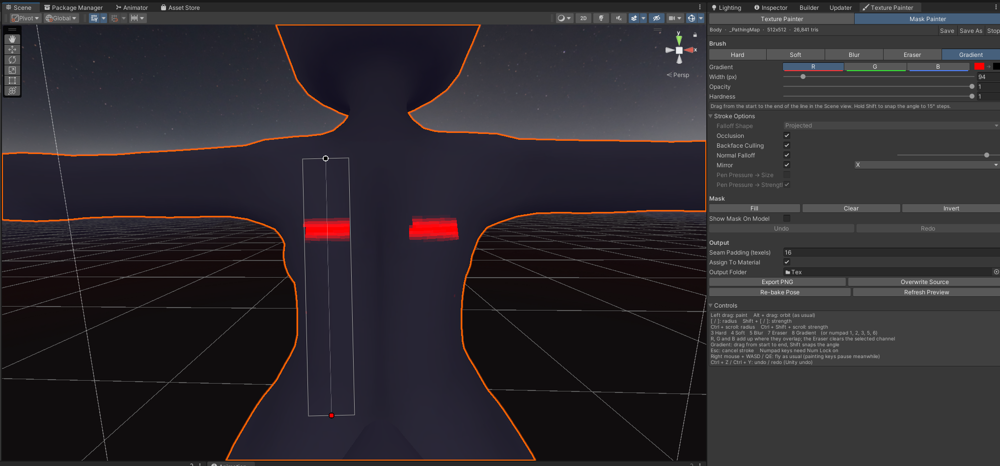

# VRC Texture Painter

**Fix your avatar's textures and paint Poiyomi and lilToon masks without leaving Unity.**

Paint over visible seams, melt hard colour edges into smooth transitions and make
body and face textures match, right on the model in the Scene view. Then switch to
the Mask Painter tab and paint emission, glitter or pathing masks in a few strokes.

Made for VRChat avatar creators on **Unity 2022.3** (Built-in render pipeline).
The tool is editor only: it adds nothing to your avatar and doesn't touch your
materials until you export.

**[Add to VCC](https://toffelskater.github.io/VRC-Texture-Painter/)** ·
[Latest release](https://github.com/ToffelsKater/VRC-Texture-Painter/releases/latest) ·
[Documentation](Packages/com.vrctexturepainter.tool/README.md)

## Fix common texture problems

### Hard lines and seams

Soften the edge with **Blur**, then run the **Blend** brush over it. Blend turns the
border into a smooth gradient between the colours on both sides, without smearing.
Strokes follow the 3D surface, so they work straight across UV seams.

### Head and body textures that don't match

Many avatars draw the face from a second texture on another UV channel, such as a
Poiyomi decal on UV2 next to the body on UV0. Add both textures, and one Blend
stroke over the neck paints both, so the colour step blends away.

## Paint masks for Poiyomi and lilToon

Pick any mask slot of the material's shader, such as Poiyomi's `_EmissionMask`,
`_GlitterMask` or `_PathingMap`, or lilToon's `_EmissionBlendMask`, and paint it on
the model. An empty slot starts black, and **Create Texture** saves a new mask and
assigns it.

| Soft emission glow | Glitter spots | Gradients for paths |
| --- | --- | --- |
|  |  |  |

**R**, **G** and **B** each change only their own channel, so several masks live in
one texture. **Mirror** paints both sides at once, and **Show Mask On Model** shows
the mask even while its effect is off.

## Install

**With the VRChat Creator Companion (recommended)**

1. Open the [package listing](https://toffelskater.github.io/VRC-Texture-Painter/) and click **Add to VCC**.
   Or in the Creator Companion go to *Settings > Packages > Add Repository* and paste
   `https://toffelskater.github.io/VRC-Texture-Painter/index.json`.
2. Open your avatar project in the Creator Companion (*Manage Project*) and add **VRC Texture Painter**.
3. In Unity, open **Tools > VRC Texture Painter**.

**Manually:** download the `.zip` or `.unitypackage` from the
[latest release](https://github.com/ToffelsKater/VRC-Texture-Painter/releases/latest).

## All features

- **Tools:** Hard, Soft, Blur, Color Blend (turns hard borders into smooth gradients without smearing), Eraser and Gradient, with pen pressure.
- **Mask Painter:** paint shader masks per R, G and B channel, with Fill, Clear, Invert and a preview on the model.
- **UV aware:** paint across seams, on mirrored and overlapping UVs, any UV channel, and UVs outside 0–1.
- **Several textures at once:** for example a Poiyomi body texture on UV0 and a face decal on UV2, painted in one stroke.
- **Layers:** 13 blend modes, opacity, visibility, lock transparency, merge down, fill and image import.
- **Workflow:** undo and redo with Ctrl+Z, project files that keep your layers, PNG export that copies the original texture's import settings, and an output folder that skips the save dialog.
- **Brush options:** occlusion, backface culling, normal falloff, sphere falloff and mirror painting.

Full documentation: [package README](Packages/com.vrctexturepainter.tool/README.md) ·
[Changelog](Packages/com.vrctexturepainter.tool/CHANGELOG.md)

## Development

This repository is a Unity 2022.3 project made from the VRChat
[template-package](https://github.com/vrchat-community/template-package).

- The package lives in `Packages/com.vrctexturepainter.tool`.
- A GPU test suite lives in `Assets/MeshTexturePainterTests` (not part of the package). Run it headless:
  `Unity.exe -batchmode -projectPath <this repo> -executeMethod MeshTexturePainter.Tests.MTPTests.Run -logFile test.log`
  and search the log for `MTPTEST`.
- **Releasing:** raise `version` in `package.json`, add a `CHANGELOG.md` entry, push, then run the **Build Release** workflow in the *Actions* tab. The Creator Companion listing rebuilds automatically after the release.

## License

[MIT](Packages/com.vrctexturepainter.tool/LICENSE.md) © ToffelsKater
